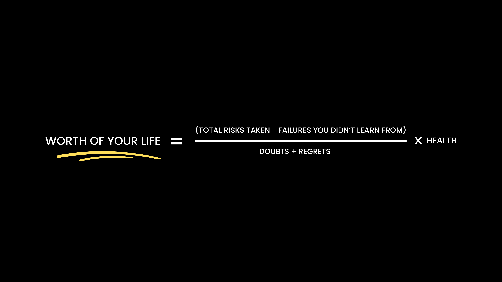

# 👋 Hi, I'm Amit P. Kumar

> I don’t maintain side projects.
> I maintain unfinished companies.

Founder of **PS TECH GLOBAL** — currently turning domains into platforms and platforms into leverage.

Some developers push commits.
I push things live and let users decide if it was a good idea.

---

## 🧠 What I Actually Do

I operate where **technology meets execution**:

* Product Engineering
* Growth Systems
* Automation Infrastructure
* AI-Driven Tools
* Market Validation

In short:
**I don’t build apps. I build outcomes.**

---

## 🏗️ Active Platforms & Networks

Each domain exists for a purpose.
Later they connect into one ecosystem.

---

### 🧠 Relite.in — Real Estate Intelligence Platform

Property buying today runs on emotions, persuasion and “limited time offer”.

Relite is being built to add logic — using credibility signals, deal validation and trust infrastructure.

**Goal:** Decisions based on data instead of pressure.

Planned direction:

* Deal reliability scoring
* Advisor credibility index
* Investment dashboards

---

### 🏢 PS TECH GLOBAL — The Infrastructure Company

The backbone behind everything.

Builds:

* web systems
* marketing engines
* automation pipelines
* growth frameworks

Every other platform depends on this.

**Goal:** A multi-industry technology holding company.

---

### 🎁 Coolcards.in — Digital Gifting Platform

Messages are temporary.
Memories shouldn’t be.

Coolcards turns digital greetings into designed, shareable experiences instead of forwarded templates.

**Goal:** Make digital wishes feel intentional.

---

### 💬 Wasupp Network — Communication Utility Layer

(Wasupp.in & Wasupp.info)

Not a social network.
More like tools people use before opening social networks.

Focused on lightweight daily utilities around messaging and sharing.

**Goal:** Become part of everyday communication flow.

---

### 👕 BindasLook Network — Commerce Infrastructure Experiment

* bindaslook.in
* bindaslook.com
* bindaslook.online

Instead of launching one brand, this builds a system that can launch many brands repeatedly.

**Goal:** E-commerce as a framework, not a single store.

---

## 🧩 How Everything Connects

PS TECH GLOBAL → Infrastructure
Relite → Trust Data Layer
Wasupp → Communication Layer
Coolcards → Engagement Layer
BindasLook → Commerce Layer

Individually useful.
Together strategic.

---

## 🧭 The Framework I Operate On

> Worth of your life = (Risks Taken − Failures You Didn't Learn From) ÷ (Doubts + Regrets) × Health

This is less philosophy and more a filter for decisions.

---

### My Interpretation

**Take risks early**
Waiting for certainty is just delayed learning.

**Learn from failure once**
Repeat mistakes are unpaid subscriptions.

**Reduce doubt by acting**
Clarity is a result, not a prerequisite.

**Protect health**
You can scale companies only if the operator scales too.

---

### Why So Many Projects?

Because iteration speed beats intelligence.

Some ideas become companies.
Some become lessons.
None become regrets.

This GitHub is not a portfolio.
It’s a build log.

---

## 🧠 Long-Term Vision

Building 5 major companies under PS TECH GLOBAL:

| Industry                | Objective                           |
| ----------------------- | ----------------------------------- |
| Artificial Intelligence | Practical real-world AI products    |
| E-Commerce              | Scalable niche brand infrastructure |
| Real Estate             | Trust & decision intelligence       |
| Manufacturing           | Physical product production         |
| Fitness & Healthcare    | Preventive health technology        |

Not launching startups.

Designing an ecosystem.

---

## ⚙️ Work Philosophy

* Ship > Perfect
* Systems > Talent
* Distribution > Features
* Execution > Ideas

---

## 🤝 If You’re Here

You probably like builders more than talkers.

Then we’ll get along.

---

⭐ Watch the repositories.
They’ll start connecting over time.
